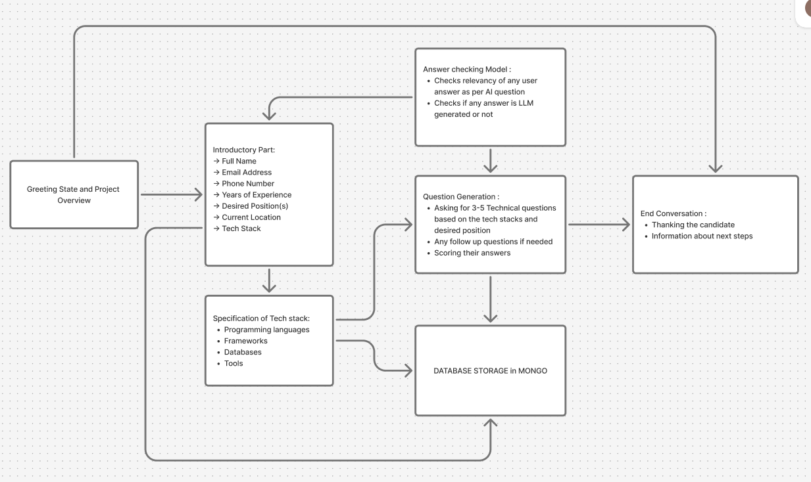
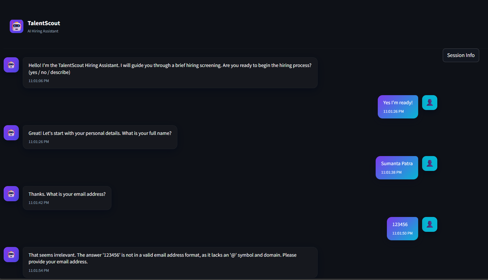

# TalentScout Hiring Assistant


*Figure 1: TalentScout AI-powered model architecture*


*Figure 2: TalentScout Chat Interface*

## Project Overview
**TalentScout** is an AI-powered hiring assistant chatbot designed to streamline the technical hiring process.  
This intelligent system conducts automated screening interviews by:

- Collecting candidate personal information  
- Generating position-specific technical questions  
- Evaluating candidate responses with AI scoring  
- Detecting AI-generated (synthetic) answers  
- Storing results in a MongoDB database  

The assistant uses **Google's Gemini AI model** to provide intelligent conversation flow, relevance checking, and technical evaluation tailored to each candidate's desired position and technology stack.

---

## Installation Instructions

### Prerequisites
- Python **3.8+**
- **MongoDB Atlas** account or local MongoDB instance
- **Google Gemini API key**

### Step-by-Step Setup

1. **Clone the repository**
   ```bash
   git clone <repository-url>
   cd talentscout-hiring-assistant

2. **Create a virtual environment**
   ```bash
   python -m venv venv
   source venv/bin/activate 

3. **Install dependencies**
   ```bash
   pip install -r requirements.txt

4. **Set up environment variables**
   - Set up environment variables
   ```bash
   GOOGLE_API_KEY=your_gemini_api_key_here
   MONGODB_URI=your_mongodb_connection_string
   DB_PASSWORD=your_mongodb_password

5. **Run the application**
   ```bash
   streamlit run hiring_assistant.py

---

## User Guide
- Start the application using the command above
- Interact with the chatbot through the Streamlit web interface
- Follow the conversation flow:
   1. Confirm readiness to begin the process
   2. Provide personal details (name, email, phone, etc.)
   3. Specify your desired position and tech stack
   4. Answer technical questions tailored to your position
   5. Receive evaluation and scoring for your responses
   6. View session information using the "Session Info" button to track progress
   7. Review results after completion (automatically saved to the database)

---

## Technical Details
**Libraries & Frameworks**
- Streamlit – Web application framework
- LangChain – LLM integration and prompt management
- Google Gemini – AI model for conversation and evaluation
- PyMongo – MongoDB database integration
- python-dotenv – Environment variable management

**AI Model**

- Gemini 2.5 Flash for main conversation and evaluation
- Custom temperature settings:
    - 0.2 for conversation
    - 0.0 for evaluation

**Architecture Decisions**
- Modular Design: Separated LLM functions, database operations, and UI components
- Session State Management: Comprehensive state tracking for conversation flow
- Response Validation: Multiple validation layers for user inputs
- Synthetic Detection: AI-generated response detection to maintain interview integrity

---

## Prompt Design
The application uses carefully crafted prompts for different purposes:

1. Intent Classification
   ```bash
   You are an intent classifier for a hiring assistant. Classify into Positive/Negative/Neutral. Return exactly: {"intent":"Positive"}

2. Relevance Checking
   ```bash
   You are a concise relevance judge. Decide if the candidate's SHORT answer is relevant to the question. Return JSON: {"relevant": true_or_false, "explanation":"one-sentence"}

3. Technical Question Generation
   ```bash
   You are a professional interviewer. Create concise technical questions tailored to the desired position and listed technologies. Return numbered list (one per line), keep each 6-12 words.

4. Answer Evaluation
   ```bash
   You are an objective evaluator. Score short answers 0-10 and optionally provide a short follow-up. Return JSON: {"score": integer, "justification":"one-sentence", "follow_up":"short question or empty"}

5. Synthetic Detection
   ```bash
   Detect if a short answer looks like it was produced by a language model. Return JSON: {"synthetic": true_or_false, "confidence": 0.0_to_1.0, "explanation":"one-sentence"}

---

## Challenges & Solutions
**Challenge 1: Conversation Flow Management**
- Problem: Maintaining context across multiple question types and user responses.
- Solution: Implemented a state machine pattern with session state tracking to manage phases (greeting, personal details, technical questions).

**Challenge 2: Response Validation**
- Problem: Ensuring user responses are relevant.
- Solution: Multi-layer validation with:
     - Regex patterns for emails & phone numbers
     - LLM-based relevance checking
     - Format-specific validation

**Challenge 3: Synthetic Answer Detection**
- Problem: Preventing candidates from using AI-generated answers.
- Solution: AI-detection algorithms that:
     - Analyze response patterns
     - Apply scoring penalties
     - Provide confidence levels

**Challenge 5: UI/UX Design**
- Problem: Creating an intuitive interface with minimal empty space.
- Solution: Custom CSS overrides for a compact, professional chat UI with responsive design.

---

## Future Enhancements

- 🌍 Multi-language support for international candidates
- 🎥 Video interview capabilities
- 📊 Advanced analytics dashboard for recruiters
- 🔗 Integration with HR platforms
- 🔒 Enhanced security and compliance features

---

## Contributing
We welcome contributions!

Please feel free to submit pull requests or open issues for bugs and feature requests.

---

## Lincense
This project is proprietary software.

All rights reserved.
```bash
Would you like me to also add **badges (like Python version, Streamlit, MongoDB, License)** at the top of the README for a more professional GitHub look?
